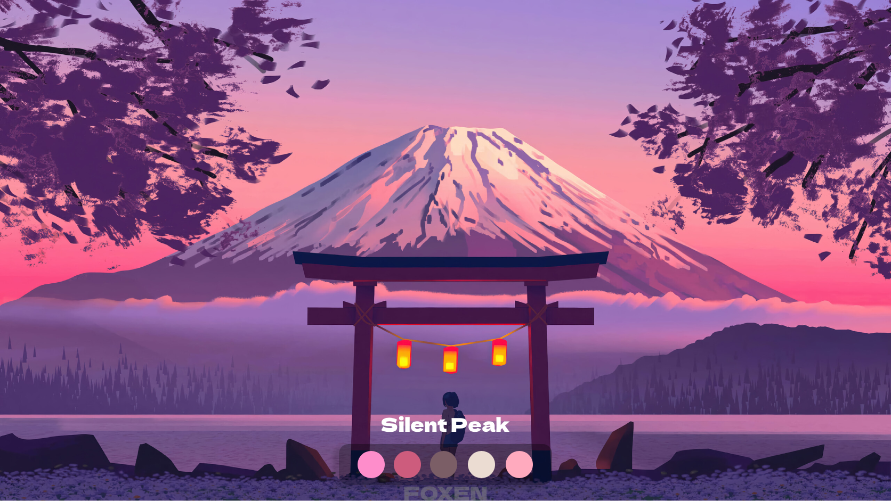
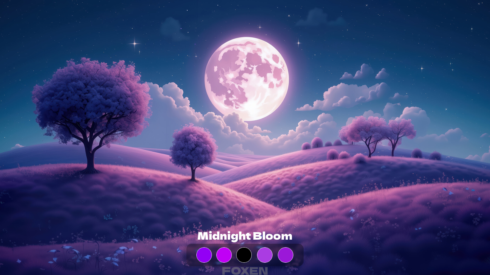
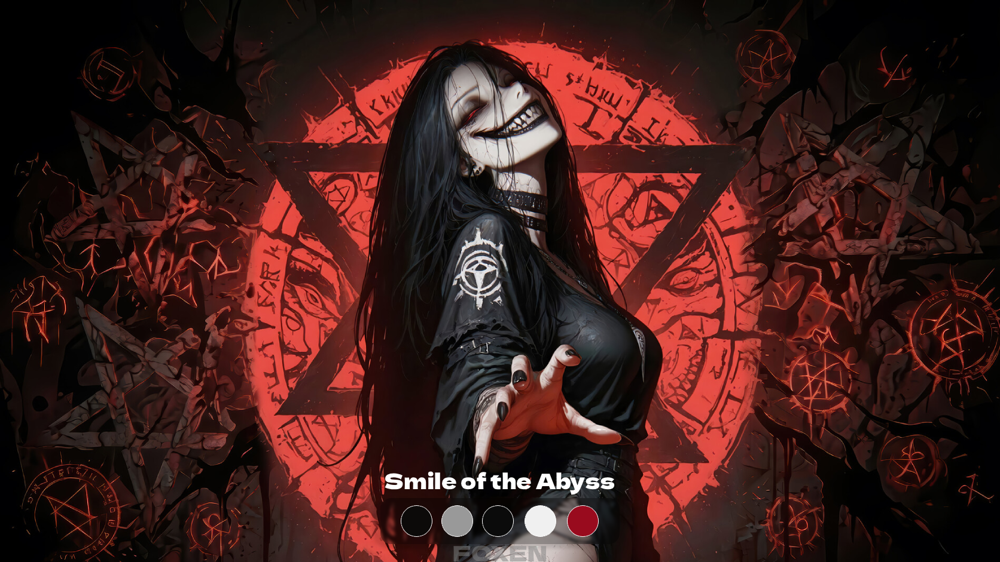
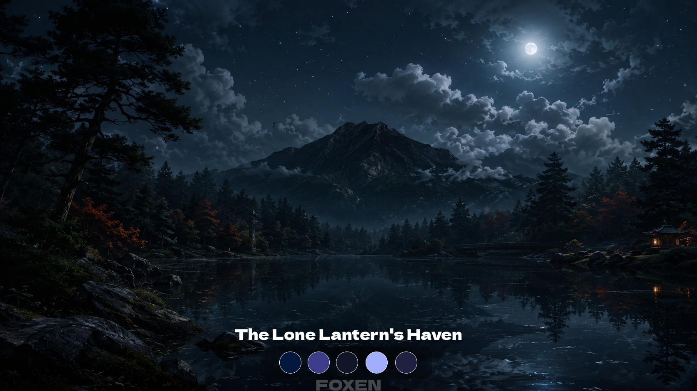

# 🦊 Foxen Themes

Добро пожаловать в официальный репозиторий тем для расширения **Foxen**! 
Здесь хранится каталог красивых кастомных тем, которые автоматически загружаются во вкладку "Кастомизация" в расширении.

## ✨ Галерея тем

Здесь представлены доступные на данный момент темы. Выберите ту, что вам по душе!

| Название | Описание | Превью |
| :--- | :--- | :--- |
| **Silent Peak** | Стильная и спокойная тема |  |
| **Gravity's Embrace** | Таинственная космическая эстетика |  |
| **Midnight Bloom** | Нежное полуночное цветение |  |
| **Smile of the Abyss** | Притягательная тёмная атмосфера |  |
| **The Lone Lantern's Haven** | Уютный свет во тьме |  |

## 🚀 Как установить?

Вам не нужно скачивать темы вручную! 
1. Установите расширение **Foxen**.
2. Перейдите во вкладку **Кастомизация**.
3. Галерея тем загрузится автоматически. Просто выберите понравившуюся и нажмите **Применить тему**!

## 🛠 Как добавить свою тему?

Если вы хотите предложить свою тему для Foxen:
1. Создайте форк этого репозитория.
2. Экспортируйте свою тему из расширения (файл `.fptheme`) и положите её в папку `themes/`.
3. Сделайте красивый скриншот темы (соотношение сторон 16:9) и положите в папку `previews/`.
4. Добавьте информацию о вашей теме в файл `index.json`.
5. Откройте **Pull Request**!